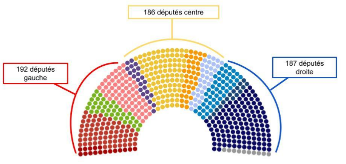
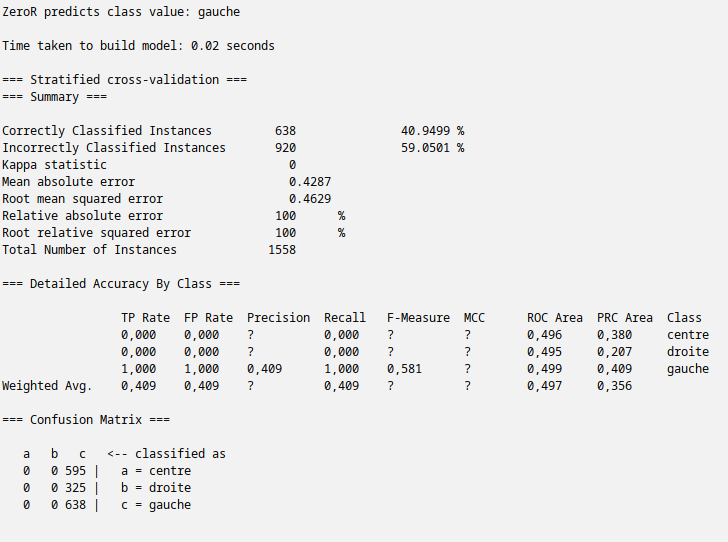
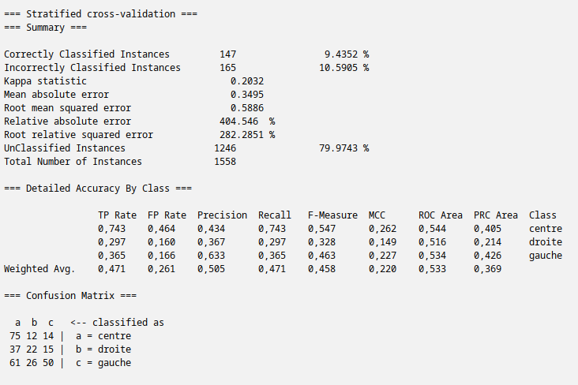
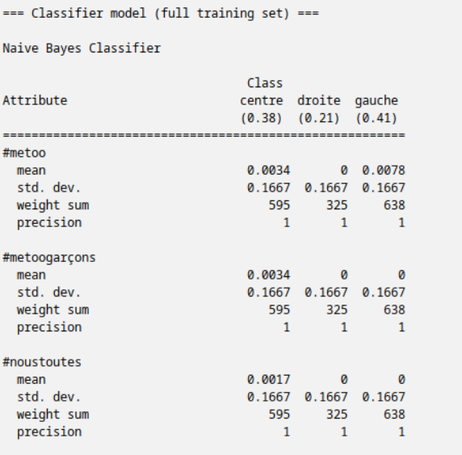
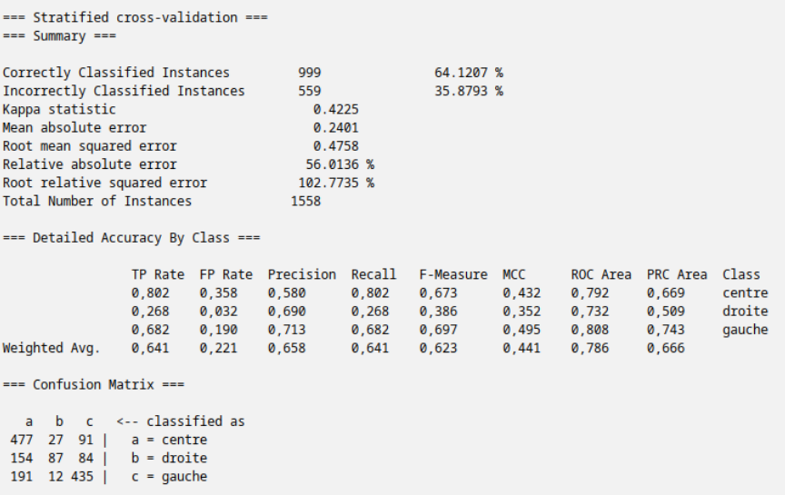
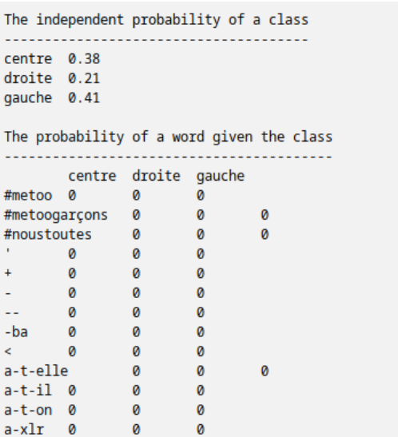
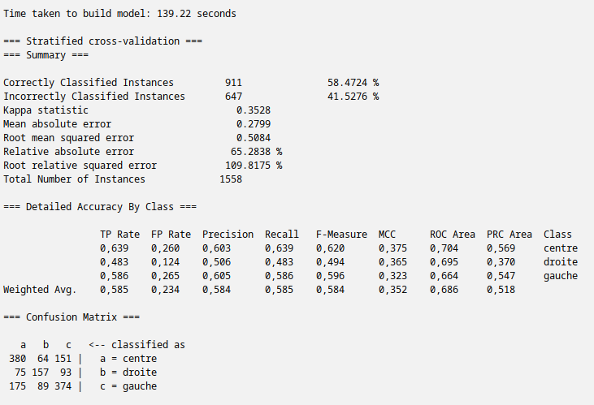
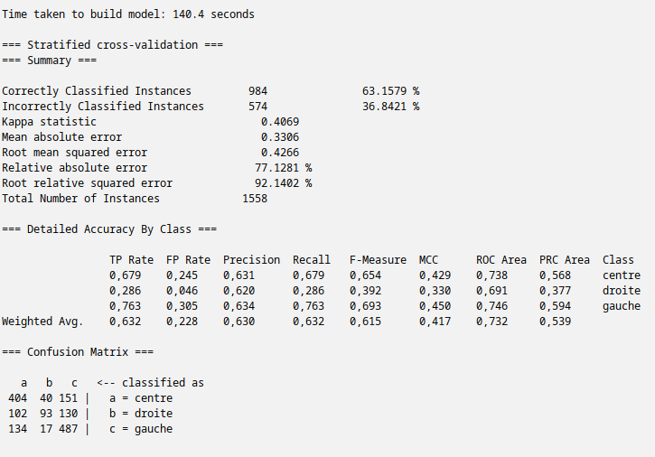

# Rapport : Projet de Fouille de Texte

## Entraînement d’un classifieur sur un corpus de discours politiques de députés à l’Assemblée Nationale

## Sommaire

- I. Constitution du Corpus
  - A. Présentation du Projet
  - B. Composition du Corpus et des Classes
  - C. Nettoyage du Corpus
- II. Analyse des effets des différents classifieurs
  - A. Weka
  - B. ZeroR
  - C. Naive Bayes
  - D. J48
  - E. SVM
- III. Conclusion

---

## I – Constitution du Corpus

### A – Présentation du Projet

L’objectif de ce projet est d’entraîner un classifieur par apprentissage automatique et de comparer les performances de différents algorithmes de classification sur un corpus que nous avons nous-même constitué. Nous avons fait le choix de travailler sur un corpus composé de discours de députés à l’Assemblée Nationale. Le but étant que le classifieur arrive à catégoriser les différents discours selon l’orientation politique du député. Il y a donc 3 classes : gauche, centre et droite.

Le sujet que nous avons choisi présente plusieurs intérêts. Entraîner un classifieur sur des discours politiques implique de traiter des textes libres, souvent riches, complexes et nuancés, pour en extraire des caractéristiques discriminantes permettant de prédire une orientation politique. Ce projet permet ainsi d'appliquer concrètement des méthodes de fouille de textes et d'apprentissage automatique dans un contexte réel, avec toutes les difficultés que cela implique (bruit dans les données, ambiguïtés linguistiques, variation de style entre les députés, etc.).

### B – Composition du Corpus et des Classes

Notre choix de travailler sur des discours de l’Assemblée Nationale présente plusieurs avantages. D’abord, puisqu’il s’agit de débats publics, toutes les données sont disponibles en [Open Source](https://data.assemblee-nationale.fr/travaux-parlementaires/debats). Ensuite, les débats en séance publique sont des fichiers XML, autrement dit, ce sont des documents structurés faciles à parser.Il a fallu dans un premier temps décider quels discours sélectionner pour notre corpus, car il est possible de retrouver des débats datant des années 2000. Nous avons donc préféré sélectionner uniquement des discours datant de la dernière législature en date, c’est-à-dire à partir de juillet 2024. Ainsi, nos 151 fichiers XML s'étendent du 18/07/2024 au 26/03/2025. Choisir ces dates nous aide aussi pour répondre à notre seconde problématique concernant la composition des classes : qu’est-ce que nous considérons être des discours de gauche, de droite et du centre ?

Effectivement, c’est une question délicate et très personnelle. Est-ce que François Hollande est de gauche ? Plutôt que de projeter nos propres opinions et de statuer au cas par cas quel député est de quel bord politique, d’autant plus que 577 députés siègent à l’Assemblée, nous avons préféré réfléchir par coalitions. Aux dernières élections législatives, trois blocs se sont distingués : un bloc de gauche composé des partis LFI, PS, PC et Écologistes, un bloc de la majorité présidentielle composé des partis Renaissance, Modem et Horizon et un bloc d’extrême droite composé des partis RN et UDR. Le parti Les Républicains n’avait formé aucune alliance. Ainsi, tous les députés appartenant aux partis des trois blocs évoqués précédemment ont été assignés respectivement à nos classes “gauche”, “centre” et “droite”. Les députés Républicains ont été rattachés à la droite de façon arbitraire. Restait seulement deux groupes de députés à classer : Libertés, Indépendants, Outre-mer  et Territoires et les non inscrits. La page Wikipédia du groupe LIOT le décrit comme réunissant des députés du centre, centre gauche et centre droit. Nous avons donc décidé de les assigner à la classe “centre”. Enfin, les non inscrits siégeant un peu partout à l’Assemblée, nous les avons écartés de notre projet.

Voici un schéma qui résume la composition de nos classes :

### C – Nettoyage du Corpus

Afin de pouvoir exploiter les données de ces fichiers XML, nous avons élaboré un script nous permettant deux choses. Premièrement, nous avons créé une fonction qui permet de parser chaque fichier XML afin de récupérer chaque intervention. Pour cela nous avons regardé la structure des fichiers XML afin de déterminer ce que l’on souhaite récupérer. Ici, en l’occurrence, ce sont des balises <textes> contenues dans des balises <paragraphes>. Ces dernières correspondent à chaque intervention lors de la séance publique. Mais ce ne sont pas toutes les interventions qui nous intéressent : afin d’avoir un corpus cohérent et d’une taille raisonnable, nous avons mis en place certains filtres. D’abord nous n’avons gardé que les interventions qui ont pour attribut “PAROLE_GENERIQUE”. Ces interventions sont des prises de parole qui peuvent être courtes comme longues, mais qui ont une certaine “substance”, contrairement aux interventions qui ont pour attribut “INTERRUPTION” notamment, qui correspondent aux moments où quelqu’un coupe la parole avec une interjection ou une apostrophe.

Nous avons également retiré toutes les occurrences où le président de l’Assemblée Nationale parle, car nous nous intéressons uniquement aux députés. Nous avons aussi décidé de garder uniquement les interventions de plus de 2000 caractères de manière arbitraire, afin de garder uniquement des textes d’une certaine longueur, afin d’avoir plus d’attributs. Enfin, nous avons nettoyé ces textes afin d’enlever les balises superflues. Pour précision, nous avons effectué tous ces traitements grâce à des expressions régulières.

Deuxièmement, nous avons créé une fonction afin de trier automatiquement ces textes dans trois sous-dossiers correspondant à nos classes : gauche, centre et droit. Pour cela nous avons établi une liste de tous les députés de gauche, du centre, et de droite, que nous avons placés respectivement dans un fichier txt pour la gauche, le centre, et la droite contenant un député par ligne. Ensuite, dans notre fonction, nous comparons le nom de l’orateur intervenant pour un texte donné, et s’il apparaît dans la liste des députés de gauche, alors nous créons un fichier txt avec ce texte dans le sous-dossier “gauche”. Cela élimine donc aussi les discours produits par les ministres durant la séance.

Au total nous avons donc 638 documents pour la gauche, 595 pour le centre et 325 pour la droite. Malgré ce déséquilibre entre les classes, nous avons fait le choix de conserver la distribution naturelle des données. En effet, ce déséquilibre reflète la réalité des prises de parole à l’Assemblée : certains groupes politiques interviennent davantage que d’autres. Modifier cette représentation aurait pu fausser l’analyse et éloigner les modèles de la situation réelle.

## II – Analyse des effets des différents classifieurs

### A – Weka

Toutes les analyses de classification menées dans le cadre de ce projet ont été réalisées à l’aide de WEKA (Waikato Environment for Knowledge Analysis), un logiciel libre et open-source développé par l’Université de Waikato en Nouvelle-Zélande. WEKA est une plateforme très utilisée dans l’enseignement et la recherche pour les tâches de fouille de données, d’exploration de textes et d’apprentissage automatique supervisé et non supervisé. Ce logiciel propose une interface graphique conviviale ainsi qu’une API en Java, permettant de tester facilement différents algorithmes de classification, de clustering, de sélection de variables ou encore de prétraitement.

Dans le cadre de notre projet, WEKA a joué un rôle central à plusieurs niveaux. D’abord, son interface accessible nous a permis de nous concentrer sur les expérimentations et l’interprétation des résultats, sans être freinés par la complexité d’un codage algorithmique. Il suffit de charger un fichier de données au format .arff, pour pouvoir appliquer en quelques clics un large éventail de classifieurs, définir une stratégie d’évaluation (par exemple une validation croisée à 10 folds), et obtenir directement les métriques pertinentes (précision, rappel, F-mesure, matrice de confusion …).

Ensuite, WEKA nous a permis de comparer rigoureusement différents algorithmes de classification sur notre corpus de discours parlementaires. Grâce à ses outils intégrés, nous avons pu mesurer les performances de chaque modèle (J48, Naive Bayes, ZeroR, SVM) dans des conditions identiques, en utilisant le même corpus prétraité et encodé. Cela nous a donné une base fiable pour tirer des conclusions sur les forces et les faiblesses relatives à chaque approche.

### B – ZeroR

Ici, nous avons utilisé le classifieur ZeroR, c’est le modèle de base le plus simple en apprentissage automatique. Ce classifieur ne prend en compte aucune des variables explicatives pour faire ses prédictions. Il se contente de toujours prédire la classe la plus fréquente dans l'ensemble d'apprentissage. Dans notre cas, ZeroR a appris à prédire exclusivement la classe « gauche », car c’est celle qui apparaît le plus souvent dans les données.

Les résultats globaux montrent que ZeroR a correctement classé 638 instances sur 1558, soit une précision de 40,95%. Cela signifie que 59,05% des cas ont été mal classés. Le coefficient Kappa est de 0, ce qui indique que le modèle ne fait pas mieux que le hasard. Les erreurs absolues et quadratiques moyennes (0.4287 et 0.4629) sont calculées sur les représentations numériques des classes et ont peu d'intérêt dans une classification nominale. Ces résultats traduisent l'incapacité du modèle à apprendre quoi que ce soit à partir des variables disponibles.

Lorsque nous examinons les performances par classe, les limites du modèle deviennent évidentes. Pour les classes “centre” et “droite”, aucune instance n’a été correctement prédite. Leur rappel est de 0, ce qui signifie qu’aucun exemple de ces classes n’a été reconnu. En revanche, la classe “gauche” a un rappel de 1, car toutes les prédictions ont été faites en sa faveur (mais ce résultat est trompeur, puisque le modèle ne choisit jamais une autre classe). La précision pour « gauche » est de 0.409, ce qui correspond simplement à la proportion d’occurrences réelles de cette classe dans l’ensemble. Les aires sous les courbes ROC et PRC sont proches de 0.5 ou très faibles, ce qui confirme que le modèle ne parvient pas à distinguer les classes.

La matrice de confusion reflète clairement cette situation. Toutes les instances ont été classées comme “gauche”, quelle que soit leur classe réelle. Ainsi, les 595 instances de la classe “centre” et les 325 de la classe “droite” ont toutes été mal classées. En revanche, les 638 instances de la classe “gauche” ont été correctement classées, ce qui donne l’illusion d’un bon rappel, mais en réalité ce n’est que le fruit du hasard biaisé par le déséquilibre des classes.

En résumé, le modèle ZeroR n’a aucune capacité prédictive. Il sert uniquement de référence de base pour évaluer la performance des autres modèles. Si un modèle plus sophistiqué (comme un arbre de décision, un SVM ou un Naive Bayes) n’obtient pas de meilleurs résultats que ZeroR, alors cela signifie que ce modèle n’exploite pas les informations des variables d’entrée. À l’inverse, toute amélioration significative par rapport à ZeroR indique que les variables explicatives contiennent bien une information utile pour la prédiction. Il serait donc pertinent de comparer ces résultats avec ceux d’un modèle plus avancé afin d’évaluer le véritable potentiel de nos données.

### C – Naive Bayes

Naive Bayes est un modèle probabiliste qui part de l’hypothèse que les attributs sont indépendants les uns des autres. Le modèle calcule un score par classe pour chaque document, et choisit la classe avec le plus grand score.

Ici, nous avons tout d’abord utilisé le modèle de base de Naive Bayes. Comme nous pouvons le voir, nous avons des résultats étranges, puisque le modèle choisit de ne tout simplement pas classifier 80% du corpus. Nous avons seulement 9,4% de documents bien classés, et 10,6% de documents mal classés. Pourtant, lorsque l’on regarde le modèle qu’il a généré, nous voyons qu’il calcule bien les probabilités d’apparition d’un mot pour chaque classe.

Nous avons alors décidé d’essayer une autre variante du modèle, qui s’appelle Naive Bayes Multinomial et qui est censé être plus adapté pour les tâches de classification impliquant des occurrences de mots ainsi qu’une grande quantité d’attributs, ce qui est le cas de notre corpus. Nous obtenons alors les résultats ci-dessous :

Comme nous pouvons le voir, le modèle fonctionne beaucoup mieux. 999 documents (soit 64% du corpus) sont bien classés, contre 559 documents (soit 36% du corpus) qui sont mal classés. Le coefficient Kappa est de 0.4225, ce qui montre que le modèle fait modérément mieux que le hasard. L’erreur absolue moyenne est de 0.2401 et l’erreur quadratique moyenne est de 0.4758. Cette dernière se situant en dessous de 0.5, nous pouvons dire que le modèle prédit de manière relativement fiable les classes.

Regardons les performances par classe de plus près. Pour le centre, nous avons un rappel de 0,802, ce qui signifie que 80% des documents “centre” ont été correctement trouvés. La précision est de 0,580, ce qui signifie que 58% des documents que le modèle a classé comme étant “centre” sont bel et bien “centre”. Pour la droite, nous avons un rappel de 0,268, ce qui signifie que 27% des documents “droite” ont été trouvés par le modèle, ce qui est un résultat assez décevant. La précision quant à elle est de 0,690, ce qui signifie que 69% des documents que le classifieur a classé comme étant “droite” étaient bel et bien “droite”, ce qui est un bon résultat. Enfin, pour la gauche, nous avons un rappel de 0,682, ce qui signifie que 68% des documents “gauche” ont été trouvés par le modèle. La précision est de 0,713, ce qui signifie que 71% des documents que le classifieur a classé comme étant “gauche” étaient bien “gauche”, ce qui est un très bon score. En résumé, la classe centre a le meilleur rappel et la classe gauche a la meilleure précision. La classe droite a un très mauvais rappel mais une bonne précision qui compense.

Si on regarde la matrice de confusion, on voit que pour la classe “centre”, sur 595 documents, 477 instances ont bien été classées, mais 27 instances ont été confondues avec “droite” et 91 avec “gauche”. Pour la classe “droite”, sur 325 documents, 87 instances ont bien été classées, 154 ont été confondues avec “centre”, et 84 ont été confondues avec “gauche”. Pour la classe “gauche”, sur 638 documents, 435 instances ont bien été classées, 191 ont été confondues avec “centre” et 12 ont été confondues avec “droite”.

Nous pouvons ainsi dire que ce modèle offre une performance acceptable, avec une bonne F-mesure de 0.62 et globalement de bonnes précisions par classe, ainsi que de bons rappels, excepté pour la classe “droite” qui a un très mauvais rappel.

Nous jugeons bon également de préciser que pour une raison qui nous échappe, bien que Naive Bayes nous affiche les probabilités de chaque mot pour chaque classe sans parvenir à classer 80% du corpus, Naive Bayes Multinomial nous affiche des probabilités de 0 pour chaque mot, alors qu’il parvient à classifier les documents de manière pertinente.

### D – J48

J48 est un classifieur basé sur les arbres de décision. Ce modèle fonctionne en construisant un arbre à partir des données d’entraînement, où chaque nœud représente un test sur une variable, chaque branche une valeur possible de cette variable, et chaque feuille une classe cible.

Le modèle a correctement classé 911 instances sur 1558, ce qui donne une précision globale de 58,47%. Le coefficient Kappa, qui mesure l'accord entre les classes prédites et réelles en tenant compte du hasard, est de 0,3528 ce qui montre un accord modéré. L’erreur absolue moyenne (0.2799) et l’erreur quadratique moyenne (0.5084) restent dans des valeurs raisonnables. Cela montre que le modèle a su capter des régularités, mais avec une marge d’erreur notable.

En se concentrant sur les performances par classe, le modèle semble relativement équilibré. Pour la classe “centre”, le rappel est de 0,639 indiquant que 63,9% des instances de cette classe sont bien identifiées. La précision est de 0,603 ce qui signifie que la majorité des prédictions “centre” sont correctes. Le F-mesure, indicateur synthétique combinant précision et rappel, atteint 0,620. Pour la classe “droite”, les résultats sont plus modestes, avec un rappel de 0,483 une précision de 0,506 et une F-mesure de 0,494. Enfin, pour la classe “gauche”, les résultats sont les meilleurs : un rappel de 0,586, une précision de 0,605 et une F-mesure de 0,596. Les aires sous les courbes ROC sont également satisfaisantes pour toutes les classes (entre 0,664 et 0,704), indiquant une bonne capacité de séparation du modèle.

La matrice de confusion détaille les bonnes et mauvaises classifications. Pour la classe  “centre” (595 instances), 380 sont correctement classées, et 215 sont mal attribuées, principalement comme “droite” (64) ou “gauche” (151).
Pour la classe “droite” (325 instances), 157 sont bien classées, tandis que 168 sont confondues avec “centre” (75) ou “gauche” (93).
Pour la classe “gauche” (638 instances), 374 sont correctement classées, tandis que 264 sont mal classées (89 en « droite », 175 en « centre »).

En résumé, le modèle J48 offre une performance correcte et équilibrée, avec une interprétabilité appréciable. Il parvient à reconnaître les trois classes avec un niveau de précision raisonnable, bien qu’il rencontre encore des difficultés sur la classe « droite », comme observé dans d’autres modèles.

### E – SVM

Le modèle SVM a été évalué par validation croisée stratifiée, ce qui garantit que chaque pli contient une proportion représentative des classes. Ce type de classifieur repose sur la recherche d’une frontière optimale entre les classes, maximisant la marge entre les exemples des différentes catégories.

Les résultats globaux montrent que le modèle a correctement classé 984 instances sur 1558, ce qui représente une précision de 63,16%. Cela signifie que plus de six prédictions sur dix sont exactes. L’erreur de classification est donc de 36,84%. Le coefficient Kappa atteint 0,4069, ce qui traduit un accord modéré entre les prédictions du modèle et les vraies classes, au-delà de ce qui serait attendu par le hasard. La mean absolute error et la root mean squared error, respectivement de 0.3306 et 0.4266, indiquent une distance moyenne relativement faible entre les classes prédites et réelles. Ces résultats suggèrent que le modèle parvient à capturer des régularités présentes dans les données.

Lorsque nous examinons les performances par classe, plusieurs différences apparaissent. Pour la classe “centre”, le modèle obtient un rappel de 0,679, ce qui signifie qu’environ 68% des instances de cette classe ont été correctement identifiées. La précision atteint 0,631, ce qui indique qu’une majorité des instances prédites comme « centre » étaient effectivement de cette classe. Le F-mesure, qui combine précision et rappel, est de 0,654, ce qui reflète une performance stable. Pour la classe “droite”, les résultats sont plus faibles : le rappel n’est que de 0,286, ce qui signifie que le modèle peine à identifier correctement les exemples de cette classe. La précision, de 0,620, est meilleure, suggérant que plus de la moitié des prédictions “droite” sont correctes. La classe “gauche”, en revanche, est mieux maîtrisée avec un rappel de 0,763 et une précision de 0,634, indiquant une meilleure capacité du modèle à identifier et prédire correctement cette catégorie.

La matrice de confusion offre une lecture plus fine de ces performances. Pour la classe “centre”, sur 595 instances, 404 sont bien classées, tandis que 191 sont confondues avec d’autres classes, principalement “droite” (151 erreurs). Pour la classe “droite”, sur 325 instances, seulement 130 sont bien prédites, et la majorité est mal classée comme “centre” (102 erreurs) ou “gauche” (93 erreurs). Enfin, pour la classe “gauche”, sur 638 observations, 487 sont correctement prédites, avec une trentaine d’erreurs vers “droite” et 134 vers “centre “.

En conclusion, le classifieur SVM parvient à extraire une structure informative dans les données, avec une performance globalement correcte. Il montre de bonnes capacités à identifier les classes “centre” et surtout “gauche”, mais a plus de difficultés avec la classe “droite”, dont le rappel est plus faible. Ce type de diagnostic est essentiel pour guider les améliorations futures : il peut être utile, par exemple, de rééquilibrer les classes, d’affiner le prétraitement des données ou d’ajuster les paramètres du modèle afin d’améliorer la détection des cas les plus difficiles.

## III – Conclusion

| Méthode                  | Accuracy | Kappa  | F-mesure  |
|--------------------------|----------|--------|-----------|
| ZeroR                    | 40.95    | 0.00   | 0.58      |
| Naive Bayes Multinomial  | 64.12    | 0.42   | 0.62      |
| SVM                      | 63.16    | 0.40   | 0.61      |
| J48                      | 58.47    | 0.35   | 0.58      |

Nous pouvons ainsi voir que les modèles Naive Bayes Multinomial et SVM ont une performance similaire, avec un léger meilleur score pour le Naive Bayes. J48 offre également une performance acceptable, mais moins bonne que les deux autres, cependant il est le modèle avec les précisions et rappels par classe les plus équilibrées. ZeroR se reposant uniquement sur le hasard comme le montre son Kappa de 0 n’est évidemment pas une méthode à considérer pour la classification.

Par ailleurs, nous avons observé pour Naive Bayes et SVM une difficulté à classer les documents de droite. En effet ils montrent tous les deux un mauvais rappel mais une bonne précision pour cette classe. Cela peut être dû au fait que cette classe étant la moins représentée, il y a moins de données sur lesquelles s’entraîner. C’est une problématique classique en fouille de textes, celle du déséquilibre entre les classes. Peut-être aussi que nos données pour la droite ne contenaient pas assez d’attributs spécifiques à cette classe. De plus, il faut se rappeler que Naive Bayes part de l’hypothèse que les attributs sont indépendants les uns des autres, or nous savons bien que le langage ne fonctionne pas comme cela, et que la présence de certains mots est conditionnée par la présence d’autres mots.

Enfin, au-delà des résultats numériques, ce travail met en évidence l’importance de croiser les indicateurs d’évaluation pour obtenir une vision nuancée des performances. Une perspective d’amélioration de nos résultats serait d'étoffer la liste de stop-words pour conserver les mots qui ont plus de substance. Une autre possibilité serait aussi de lemmatiser le corpus pour retirer les flexions et comparer ces nouveaux résultats avec nos résultats.

